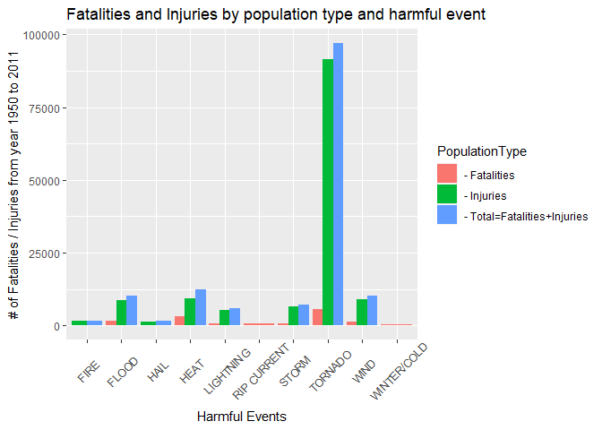

# Synopsis

This is the second project for Reproducible Research class. Two analyses have been conducted by exploring the U.S. National Oceanic and Atmospheric Administration's (NOAA) storm database with data from 1950 to 2011. The first anslysis summarized and compared the number of population health by harmful event. The Result: TORNADO is the most harmful weather event to the population health. The second anslysis summarized the total damages by event. The Result: The weather events that cause most economic damages are (by most dollar amount): FLOOD, HURRICAN, STORM, and TORNADO.

# R environment (Session Info)


```r
sessionInfo()
```

```
## R version 4.0.2 (2020-06-22)
## Platform: x86_64-w64-mingw32/x64 (64-bit)
## Running under: Windows 10 x64 (build 19041)
## 
## Matrix products: default
## 
## locale:
## [1] LC_COLLATE=English_United States.1252 
## [2] LC_CTYPE=English_United States.1252   
## [3] LC_MONETARY=English_United States.1252
## [4] LC_NUMERIC=C                          
## [5] LC_TIME=English_United States.1252    
## 
## attached base packages:
## [1] stats     graphics  grDevices utils     datasets  methods   base     
## 
## loaded via a namespace (and not attached):
##  [1] compiler_4.0.2  magrittr_2.0.1  tools_4.0.2     htmltools_0.5.0
##  [5] yaml_2.2.1      stringi_1.5.3   rmarkdown_2.5   knitr_1.30     
##  [9] stringr_1.4.0   xfun_0.19       digest_0.6.25   rlang_0.4.7    
## [13] evaluate_0.14
```

# Source data and documentations

+ Source [Storm Data](https://d396qusza40orc.cloudfront.net/repdata%2Fdata%2FStormData.csv.bz2) [47Mb]
+ National Weather Service [Storm Data Documentation](https://d396qusza40orc.cloudfront.net/repdata%2Fpeer2_doc%2Fpd01016005curr.pdf)
+ National Climatic Data Center Storm Events [FAQ](https://d396qusza40orc.cloudfront.net/repdata%2Fpeer2_doc%2FNCDC%20Storm%20Events-FAQ%20Page.pdf)

# Load required libraries


```r
library(tidyverse)
```

```
## Warning: package 'tidyverse' was built under R version 4.0.3
```

```
## -- Attaching packages --------------------------------------- tidyverse 1.3.0 --
```

```
## v ggplot2 3.3.2     v purrr   0.3.4
## v tibble  3.0.3     v dplyr   1.0.2
## v tidyr   1.1.2     v stringr 1.4.0
## v readr   1.4.0     v forcats 0.5.0
```

```
## Warning: package 'ggplot2' was built under R version 4.0.3
```

```
## Warning: package 'tidyr' was built under R version 4.0.3
```

```
## Warning: package 'readr' was built under R version 4.0.3
```

```
## Warning: package 'forcats' was built under R version 4.0.3
```

```
## -- Conflicts ------------------------------------------ tidyverse_conflicts() --
## x dplyr::filter() masks stats::filter()
## x dplyr::lag()    masks stats::lag()
```

```r
library(sqldf)
```

```
## Loading required package: gsubfn
```

```
## Loading required package: proto
```

```
## Loading required package: RSQLite
```

```r
library(ggplot2)
```

# Download and read data into data frame


```r
URL <- "https://d396qusza40orc.cloudfront.net/repdata%2Fdata%2FStormData.csv.bz2"
destFile <- "repdata_data_StormData.csv.bz2"
if (!file.exists(destFile)){
        download.file(URL, destfile = destFile, mode='wb')
}
StormData <- read.csv("repdata_data_StormData.csv.bz2")
```

# Data processing

## List of source data variables used for analysis

### Health population variables
    
+ FATALITIES: death population
+ INJURIES: injury population

### Economic evaluation variables
        
+ PROPDMG: Property damage value
+ PROPDMGEXP: Unit of property damage 
+ CROPDMG: Crop damage value
+ CROPDMGEXP: Unit of crop damage 

### Weather event variable 
    
+ EVTYPE: weather event
        
## Data justification and transformation
  
### List of unit convertion rates (to dolloars)
    
+ ("M","m","6")	=10^6
+ ("B","b","9")	=10^9
+ ("H","h","2")	=10^2
+ ("","0")	    =10^0
+	"4"		        =10^4
+ "5"		        =10^5
+ "7"		        =10^7
+ "8"		        =10^8
+ "+"		        =1.01
+ "-"		        =0.99

### Logics to transform source events to new groups of event 

+ if EVTYPE contains "HURRICANE" then newEVTYPE = "HURRICANE"
+ else if EVTYPE contains "TORNADO" then newEVTYPE = "TORNADO" 
+ else if EVTYPE contains "FLOOD" then newEVTYPE = "FLOOD"
+ else if EVTYPE contains "LIGHTNING" or "LIGHTNING" then newEVTYPE = "LIGHTNING"
+ else if EVTYPE contains "AVALANCE" or "AVALANCHE" then newEVTYPE = "AVALANCHE"
+ else if EVTYPE contains "BLIZZARD" then newEVTYPE = "BLIZZARD"
+ else if EVTYPE contains "DROUGHT" then newEVTYPE = "DROUGHT"
+ else if EVTYPE contains "HAIL" then newEVTYPE = "HAIL"
+ else if EVTYPE contains "HEAT" then newEVTYPE = "HEAT"
+ else if EVTYPE contains "STORM" then newEVTYPE = "STORM"
+ else if EVTYPE contains "RIP CURRENT" then newEVTYPE = "RIP CURRENT"
+ else if EVTYPE contains "SNOW" then newEVTYPE = "SNOW"
+ else if EVTYPE contains "RAIN" then newEVTYPE = "RAIN"
+ else if EVTYPE contains "WIND" then newEVTYPE = "WIND"
+ else if EVTYPE contains "FIRE" then newEVTYPE = "FIRE"
+ else if EVTYPE contains any of ("WINTER","COLD","FREEZE","FROST","COOL","LOW") then newEVTYPE ="WINTER/COLD"
+ else if EVTYPE contains "DRY" then newEVTYPE = "DRY"
+ else if EVTYPE contains "DUST" or "FOG" then newEVTYPE = "DUST/FOG"
+ else if EVTYPE contains "TIDE" then newEVTYPE = "TIDE"
+ else if EVTYPE contains "SURE" then newEVTYPE = "SURE"
+ else newEVTYPE = "OTHER"

    	
# Create analysis data by following above specifications

## Extract variables and convert damage values into dollars
      

```r
AnaData <- sqldf('select EVTYPE, FATALITIES, INJURIES, PROPDMG, PROPDMGEXP,
                case when PROPDMGEXP in ("K","k","3") then 1000
                     when PROPDMGEXP in ("M","m","6") then 1000000 
                     when PROPDMGEXP in ("B","b","9") then 1000000000
                     when PROPDMGEXP in ("H","h","2") then 100
                     when PROPDMGEXP in ("","0") then 1
                     when PROPDMGEXP="4" then 10000 
                     when PROPDMGEXP="5" then 100000
                     when PROPDMGEXP="7" then 10000000
                     when PROPDMGEXP="8" then 100000000
                     when PROPDMGEXP="+" then 1.01
                     when PROPDMGEXP="-" then 0.99 
                     else 0 end as prop_rate,
                CROPDMG, CROPDMGEXP,
               case when CROPDMGEXP in ("K","k","3") then 1000
                     when CROPDMGEXP in ("M","m","6") then 1000000 
                     when CROPDMGEXP in ("B","b","9") then 1000000000
                     when CROPDMGEXP in ("H","h","2") then 100
                     when CROPDMGEXP in ("","0") then 1
                     when CROPDMGEXP="4" then 10000 
                     when CROPDMGEXP="5" then 100000
                     when CROPDMGEXP="7" then 10000000
                     when CROPDMGEXP="8" then 100000000
                     when CROPDMGEXP="+" then 1.01
                     when CROPDMGEXP="-" then 0.99 
                     else 0 end as crop_rate
                from StormData  ')

AnaData <- sqldf('select *, prop_rate*PROPDMG as propdmg_dollar, 
                        CROPDMG*crop_rate as cropdmg_dollar from AnaData ')
```

## Add new analysis event variable
      

```r
AnaData$newEVTYPE <- "OTHER"
AnaData$newEVTYPE[grep("SURF", AnaData$EVTYPE, ignore.case = TRUE)] <- "SURF"
AnaData$newEVTYPE[grep("TIDE", AnaData$EVTYPE, ignore.case = TRUE)] <- "TIDE"
AnaData$newEVTYPE[grep("DUST", AnaData$EVTYPE, ignore.case = TRUE)] <- "DUST/FOG"
AnaData$newEVTYPE[grep("FOG", AnaData$EVTYPE, ignore.case = TRUE)] <- "DUST/FOG"
AnaData$newEVTYPE[grep("RAIN", AnaData$EVTYPE, ignore.case = TRUE)] <- "RAIN"
AnaData$newEVTYPE[grep("DRY", AnaData$EVTYPE, ignore.case = TRUE)] <- "DRY"
AnaData$newEVTYPE[grep("LOW", AnaData$EVTYPE, ignore.case = TRUE)] <- "WINTER/COLD"
AnaData$newEVTYPE[grep("COOL", AnaData$EVTYPE, ignore.case = TRUE)] <- "WINTER/COLD"
AnaData$newEVTYPE[grep("FROST", AnaData$EVTYPE, ignore.case = TRUE)] <- "WINTER/COLD"
AnaData$newEVTYPE[grep("FREEZE", AnaData$EVTYPE, ignore.case = TRUE)] <- "WINTER/COLD"
AnaData$newEVTYPE[grep("COLD", AnaData$EVTYPE, ignore.case = TRUE)] <- "WINTER/COLD"
AnaData$newEVTYPE[grep("WINTER", AnaData$EVTYPE, ignore.case = TRUE)] <- "WINTER/COLD"
AnaData$newEVTYPE[grep("FIRE", AnaData$EVTYPE, ignore.case = TRUE)] <- "FIRE"
AnaData$newEVTYPE[grep("WIND", AnaData$EVTYPE, ignore.case = TRUE)] <- "WIND"
AnaData$newEVTYPE[grep("SNOW", AnaData$EVTYPE, ignore.case = TRUE)] <- "SNOW"
AnaData$newEVTYPE[grep("RIP CURRENT", AnaData$EVTYPE, ignore.case = TRUE)] <- "RIP CURRENT"
AnaData$newEVTYPE[grep("STORM", AnaData$EVTYPE, ignore.case = TRUE)] <- "STORM"
AnaData$newEVTYPE[grep("HAIL", AnaData$EVTYPE, ignore.case = TRUE)] <- "HAIL"
AnaData$newEVTYPE[grep("HEAT", AnaData$EVTYPE, ignore.case = TRUE)] <- "HEAT"
AnaData$newEVTYPE[grep("RECORD HIGH", AnaData$EVTYPE, ignore.case = TRUE)] <- "HEAT"
AnaData$newEVTYPE[grep("DROUGHT", AnaData$EVTYPE, ignore.case = TRUE)] <- "DROUGHT"
AnaData$newEVTYPE[grep("BLIZZARD", AnaData$EVTYPE, ignore.case = TRUE)] <- "BLIZZARD"
AnaData$newEVTYPE[grep("AVALANC", AnaData$EVTYPE, ignore.case = TRUE)] <- "AVALANCHE"
AnaData$newEVTYPE[grep("LIGHTING", AnaData$EVTYPE, ignore.case = TRUE)] <- "LIGHTNING"
AnaData$newEVTYPE[grep("LIGHTNING", AnaData$EVTYPE, ignore.case = TRUE)] <- "LIGHTNING"
AnaData$newEVTYPE[grep("FLOOD", AnaData$EVTYPE, ignore.case = TRUE)] <- "FLOOD"
AnaData$newEVTYPE[grep("TORNADO", AnaData$EVTYPE, ignore.case = TRUE)] <- "TORNADO"
AnaData$newEVTYPE[grep("HURRICANE", AnaData$EVTYPE, ignore.case = TRUE)] <- "HURRICANE"
```


# Analysis

## Get summarized data by population type and event (top 8 events)
      

```r
q1adf <-  sqldf('select newEVTYPE, "- Fatalities" as PopulationType, sum(FATALITIES) as "value" 
              from AnaData group by newEVTYPE, PopulationType') %>% top_n(8, value)
q1adi <-  sqldf('select newEVTYPE, "- Injuries" as PopulationType, sum(INJURIES) as "value" 
              from AnaData group by newEVTYPE, PopulationType') %>% top_n(8, value)
q1adt <-  sqldf('select newEVTYPE, "- Total=Fatalities+Injuries" as PopulationType, 
                sum(FATALITIES+INJURIES) as "value" 
              from AnaData group by newEVTYPE, PopulationType') %>% top_n(8, value)

q1AnaData <- rbind(q1adf, q1adi, q1adt)
```

## The 1st graph: Fatalities and Injuries by population type and harmful event
      

```r
ggplot(q1AnaData,aes(x = newEVTYPE, y = value)) + 
        geom_bar(aes(fill = PopulationType),stat = "identity",position = "dodge") + 
        theme(axis.text.x = element_text(angle = 45, vjust = 0.6, hjust=0.5)) +
        labs(x = "Harmful Events")+
        labs(y = " # of Fatalities / Injuries from year 1950 to 2011 ")+
        labs(title = "Fatalities and Injuries by population type and harmful event")
```

<!-- -->

* above graph shows TORNADO is the #1 harmful event to population health.


## Get summarized data by damage type and event (top 8 events)
      

```r
q2adp <-  sqldf('select newEVTYPE, "- Property" as DamageType, sum(propdmg_dollar) as "value" 
              from AnaData group by newEVTYPE, DamageType') %>% top_n(8, value)
q2adc <-  sqldf('select newEVTYPE, "- Crop" as DamageType, sum(cropdmg_dollar) as "value" 
              from AnaData group by newEVTYPE, DamageType') %>% top_n(8, value)
q2adt <-  sqldf('select newEVTYPE, "- Total=Crop+Property" as DamageType, 
                sum(propdmg_dollar+cropdmg_dollar) as "value" 
              from AnaData group by newEVTYPE, DamageType') %>% top_n(8, value)

q2AnaData <- rbind(q2adp, q2adc, q2adt)
```

## The 2nd graph: Economic damage by damage type and harmful event
      

```r
ggplot(q2AnaData,aes(x = newEVTYPE, y = value/1000000000)) + 
        geom_bar(aes(fill = DamageType),stat = "identity",position = "dodge") + 
        theme(axis.text.x = element_text(angle = 45, vjust = 0.7, hjust=0.6)) +
        labs(x = "Harmful Events")+
        labs(y = "Total damage in billions from 1950 to 2011")+
        labs(title = "Economic damage by damage type and harmful event")
```

<!-- -->

* above graph shows FLOOD has the greatest economic consequences.

# Analysis Summary Result

* Across the United States, TORNADOS are the most harmful to population health.
* Across the United States, FLOOD, HURRICANE, STORM and TORNADO have the greatest economic consequences.
